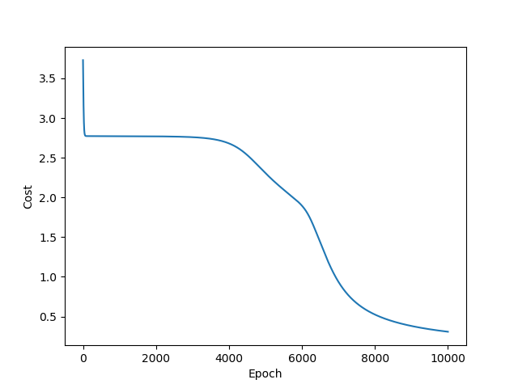

# Simple XOR Neural Network Implementation
This code implements a simple XOR neural network with 2 layers

## Requirements
* Python 3
* Matplotlib

## Info
&#35; Input nodes = 2  
&#35; Hidden nodes = 2  
&#35; Output nodes = 1  
&#35; Training epochs = 10000  
Learning rates = 0.1

## Getting started
```
git clone https://github.com/wj1224/simple_xor_nn.git
cd simple_xor_nn
python xor_net.py
```

## Cost plot

